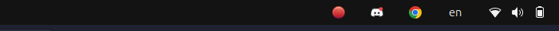
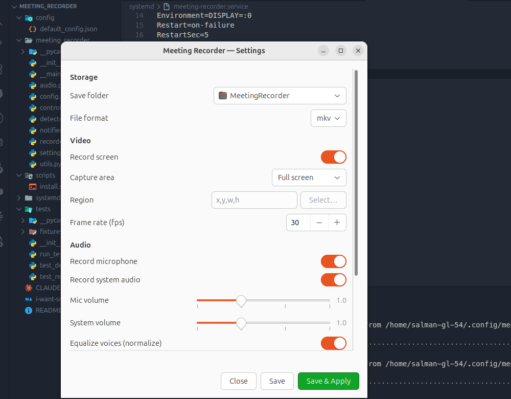

# Smart Meeting Recorder

**Detects when you join an online meeting on Linux and asks before recording your screen, mic, and
system audio. Stops automatically when the call ends.**

[](LICENSE)


No more remembering to hit record. The app sits in the background, notices when a call starts, and
asks:

> **Meeting detected.** Start recording?  ▸ `Record`  `Ignore`

One click records the screen, your microphone and (optionally) system audio. When the call ends,
recording stops on its own and the file is saved as `Zoom_2026-07-17_14-30-05.mkv`.

**Privacy-first:** it never records without your explicit consent.

| Tray controls | Settings |
|---|---|
|  |  |

---

## ⚠️ Requirements — read this first

| | |
|---|---|
| **Session** | **X11 only.** Screen capture uses `x11grab`. **Wayland is not supported yet.** |
| OS | Debian/Ubuntu (built and tested on Ubuntu 24.04) |
| Desktop | GNOME (tray icon needs the AppIndicator extension, shipped by default on Ubuntu) |
| Audio | PipeWire or PulseAudio |

Ubuntu 24.04 defaults to **Wayland**. Check your session:

```bash
echo $XDG_SESSION_TYPE     # must print: x11
```

If it prints `wayland`, log out and pick **"Ubuntu on Xorg"** from the gear menu on the login
screen. Wayland support is on the roadmap — see [Known limitations](#known-limitations).

## Install

### Option 1 — APT repository (recommended, auto-updates)

```bash
curl -fsSL https://sskazal.github.io/meeting-recorder/KEY.gpg \
  | sudo gpg --dearmor -o /usr/share/keyrings/meeting-recorder.gpg

echo "deb [arch=all signed-by=/usr/share/keyrings/meeting-recorder.gpg] https://sskazal.github.io/meeting-recorder stable main" \
  | sudo tee /etc/apt/sources.list.d/meeting-recorder.list

sudo apt update && sudo apt install meeting-recorder
```

Updates then arrive with `apt upgrade` like any other package.

### Option 2 — download the `.deb`

Grab it from [Releases](../../releases) — `apt` pulls in ffmpeg and the rest automatically:

```bash
sudo apt install ./meeting-recorder_0.1.2_all.deb
```

The background service is enabled for you and starts at your next login. To start it right away:

```bash
systemctl --user start meeting-recorder
```

<details>
<summary>Optional: better noise cancellation, and region drag-select</summary>

```bash
# Drag-select a screen region in Settings
sudo apt install slop

# Studio-grade mic denoising (RNNoise). Then set
# "noise_model_path": "~/.local/share/meeting-recorder/std.rnnn" in your config.
mkdir -p ~/.local/share/meeting-recorder
curl -L -o ~/.local/share/meeting-recorder/std.rnnn \
  https://raw.githubusercontent.com/GregorR/rnnoise-models/master/somnolent-hogwash-2018-09-01/sh.rnnn
```
</details>

## Usage

Once installed there's nothing to do — join a call and answer the popup. Recordings land in
`~/Videos/MeetingRecorder/`.

### Tray controls

While recording, an icon appears in the top bar. Click it for:

- **● Recording — 01:23** — live timer
- **Pause / Resume**
- **Stop & Save**
- **Open recordings folder**
- **Settings…**

**Pause excludes paused time.** Record for 20 minutes but pause from 10:00–15:00 and the saved file
is **15 minutes** — the paused span never reaches the file.

There's no "recording started" notification; the tray icon already shows it. When you stop, audio is
balanced in the background — you'll see a brief *"Processing recording…"*, then **"Recording saved"**
with a **📁 Open Folder** button.

### Settings

Open **Meeting Recorder Settings** from your app grid, or:

```bash
meeting-recorder settings
```

Change save folder, format, frame rate, mic/system volume, normalization, noise cancellation,
capture area and behavior. **Save & Apply** restarts the service so changes take effect.

### Command line

```bash
meeting-recorder status     # service state + capture streams + meeting match
meeting-recorder start      # start the background service
meeting-recorder stop       # stop it (pause detection)
meeting-recorder restart    # restart it (apply setting changes)
meeting-recorder logs       # follow the service log
meeting-recorder settings   # settings window
meeting-recorder run        # run the detector in the foreground
meeting-recorder record     # record right now until Ctrl-C
meeting-recorder config     # create/print the config file
```

`start`/`stop`/`restart`/`logs` wrap `systemctl --user`, so you never need to
remember the `--user` flag. The equivalents are:

```bash
systemctl --user status|start|stop|restart meeting-recorder
journalctl --user -u meeting-recorder -f
```

> **Why `--user`?** This is a *user* service, not a system one: it needs your X
> display (screen capture), your PulseAudio session (mic/system audio) and your
> D-Bus session (notifications, tray icon). A system service runs as root with
> none of those, so it must run in your session — hence `--user`, or just use the
> wrapper commands above.

## Configuration

The GUI covers everything, but the config file is
`~/.config/meeting-recorder/config.json` (it **overrides** the shipped defaults).

| Key | Meaning |
|-----|---------|
| `output_dir` | Where recordings are saved (default `~/Videos/MeetingRecorder`) |
| `container` | `mkv` (default, crash-safe) or `mp4` |
| `framerate`, `video_codec`, `video_preset` | Encoding options |
| `record_screen` / `record_mic` / `record_system_audio` | Toggle capture sources |
| `capture_mode` | `fullscreen`, `window` (focused window), or `area` |
| `capture_region` | `"x,y,w,h"` when `capture_mode` is `area` |
| `normalize_voice` | Normalize **both** your mic and the caller to the same loudness so both voices match (default `true`) |
| `mic_volume` / `system_volume` | Fine-trim after normalization (`1.0` = equal). Raise `mic_volume` to sit above the caller |
| `noise_cancellation` | Filter background noise from the mic (default `true`) |
| `noise_model_path` | Optional RNNoise `.rnnn` model for better denoising |
| `auto_record` | Skip the popup and record automatically |
| `prompt_timeout_seconds` | How long the popup waits for an answer |
| `start_debounce_seconds` / `stop_debounce_seconds` | How long audio must be present/absent before starting/stopping |
| `poll_interval_seconds` | How often capture streams are checked |
| `min_recording_seconds` | Discard recordings shorter than this |
| `allowlist` | `{"match": "<substring>", "app": "<Display Name>"}` rules |

To watch another app, add an allowlist entry matching its process name:

```json
{"match": "webex", "app": "Webex"}
```

## How it works

**Detection.** A meeting means *a known app is actively using your microphone*. PipeWire/PulseAudio
exposes every mic capture as a stream tagged with the owning app, so `pactl` gives one reliable
signal that covers Zoom, Teams, Discord, Slack and browser calls alike. Streams that only tap system
audio (music players) are ignored, so background audio never triggers it. A debounce prevents brief
audio drops from starting or stopping a recording.

**Recording is two-stage.** Live capture writes the video plus your mic and the system audio as
*separate, unprocessed* tracks — no filters, so there's no latency and pause can cut exactly. When
you stop, a finalize pass concatenates the segments, denoises the mic, normalizes both audio sources
to the same loudness (EBU R128), mixes and limits them — and **stream-copies the video**, so it's
quick. This is why both voices come out level and why pausing is exact.

## Troubleshooting

**Nothing happens when I join a meeting**
```bash
meeting-recorder status        # is your app listed and matched?
journalctl --user -u meeting-recorder -f
```
If your app isn't matched, add it to the `allowlist`.

**Black screen / no video** — you're probably on Wayland. Run `echo $XDG_SESSION_TYPE`; it must say
`x11`. Log in with "Ubuntu on Xorg".

**No tray icon** — the GNOME AppIndicator extension must be enabled:
```bash
gnome-extensions enable ubuntu-appindicators@ubuntu.com
```
Without it, a floating control pill appears instead.

**My voice is too quiet / the caller is too loud** — keep `normalize_voice: true` and leave both
volumes at `1.0`; that makes them equal. Nudge `mic_volume` to `1.2` to sit slightly above the caller.

**Recording is choppy** — 1080p30 is demanding. Lower `framerate` to `20`, or set
`video_preset` to `ultrafast`.

**Changes to settings did nothing** — restart the service (`systemctl --user restart
meeting-recorder`), and make sure you edited `~/.config/meeting-recorder/config.json`.

## Uninstall

```bash
sudo apt remove meeting-recorder          # or: apt purge
rm -rf ~/.config/meeting-recorder         # optional: your settings
```
Your recordings in `~/Videos/MeetingRecorder/` are never touched.

## Development

```bash
git clone https://github.com/ssKazal/meeting-recorder.git && cd meeting-recorder
sudo apt install python3-gi gir1.2-gtk-3.0 gir1.2-notify-0.7 \
                 gir1.2-appindicator3-0.1 ffmpeg pulseaudio-utils \
                 x11-utils x11-xserver-utils

python3 -m meeting_recorder run     # run from source
python3 tests/run_tests.py          # tests — zero dependencies, no pytest needed
./packaging/build-deb.sh            # build dist/meeting-recorder_<version>_all.deb
```

No Python packages are required — the app runs on the system `python3` with the distro's PyGObject.
See [CLAUDE.md](CLAUDE.md) for the architecture rationale (especially *why audio filters must not run
during live capture*).

## Known limitations

- **Wayland is not supported** — X11 only for now (`x11grab`). Wayland needs the PipeWire portal.
- **Window/region capture is a fixed rectangle** — moving the window mid-call won't move the capture.
- **Audio is processed at save time**, so volume/normalization changes apply to new recordings only.
  A 1-hour meeting takes a few minutes to finalize in the background.
- Browser calls are detected by mic use, so any browser mic usage counts as a call.

## Contributing

Issues and pull requests are welcome. Please run `python3 tests/run_tests.py` before submitting.

## License

[MIT](LICENSE) — see [CHANGELOG.md](CHANGELOG.md) for release notes.
